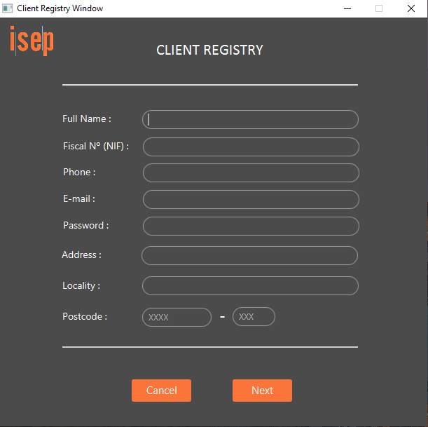
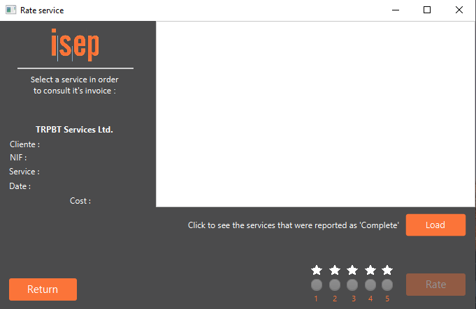
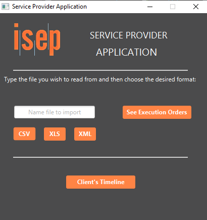

# ISEP-LAPR2-2018/19

Final Project of the Laboratory/Project II unit course.
The previous, was done in Java and JavaFX [1], using SceneBuilder.

The images below are printScreens of the app during execution, under various situations.

------------------

1º Year, 2º Semester

------------------

##### Home Page
This is the opening window, that allows a registered Client or Service Provider login, the registration of new Users, aswell as submission of applications to become a Service Provider.

##### Login Menu
Obtained after clicking "Login" at the Home Page.

##### Registration Menu
Obtained after clicking "Register" at the Home Page.

##### Client Menu
Obtained after logging in with a registered Client e-mail / pass.

##### Rating Services Window
This window would allow the Client to load the services done by a Service provider, get the Invoice on the left, and rate the service(0-5) done by the provided person.

##### Service Provider Menu
Obtained after loggin in with a registered Service Provider e-mail / pass.

##### Indicate Availability

Service Providers can indicate their availability on a period of time.

##### Indicate Availability 
By clicking on the Calendar Icon, Service Providers can choose the Start day and End day of their availability, aswell as the hour.

##### Consult Execution Orders

This allows Service Providers to consult the execution orders attributed to them, considering their availability. Allows aswell the Service Provider to export the said orders into a CSV, XLS or XML file.

##### Appliance to Service Provider - Qualifications

After choosing the "Submit Application" option in the Home Page, and filling the standard information (similar to Registration Menu shown above), appliers are given the chance to enter their Academic and Professional qualifications.

##### Appliance to Service Provider - Categories

After the above, appliers get to choose from the Company's available types of provided services.

##### Service Provider App Main View

This is the view from the Service Provider App. Intended for Service Providers to consult the file/s exported from the previous login in the main application.

----------------

#### References
[1] - https://en.wikipedia.org/wiki/JavaFX

